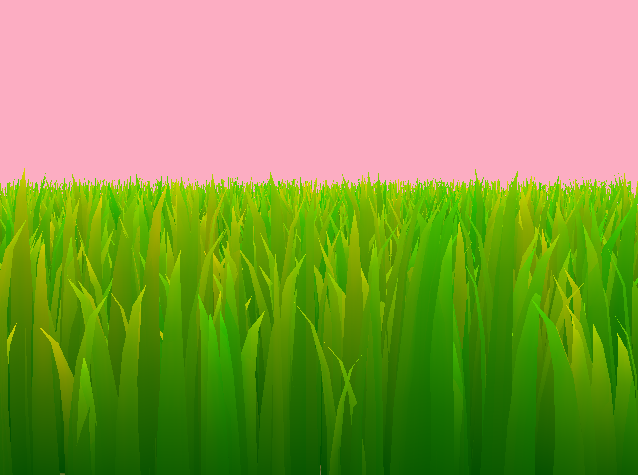

Vulkan Grass Rendering
==================================

**University of Pennsylvania, CIS 565: GPU Programming and Architecture, Project 5**

- Dineth Meegoda
  - [LinkedIn](https://www.linkedin.com/in/dinethmeegoda/), [Personal Website](https://www.dinethmeegoda.com).
- Tested on: Windows 10 Pro, Ryzen 9 5900X 12 Core @ 3.7GHz 32GB, RTX 3070 8GB

## Summary

This Vulkan project exploring real-time rendering of millions of blades of grass involves using tessellation shaders, compute shaders, and bezier curves. The implementation is based on the paper [Responsive Real-Time Grass Rendering for General 3D Scenes](https://www.cg.tuwien.ac.at/research/publications/2017/JAHRMANN-2017-RRTG/JAHRMANN-2017-RRTG-draft.pdf).

The core of implementation comes from scattering random points using a gaussian distribution on the surface of an input mesh (along with random parameters of grass width height and orientation) and bringing them into a compute shader to calculate the physical properties of each blade of grass. Each thread focuses on calculating the properties of a single blade of grass and performs tests based on the camera frustum, distance, and blade orientation to decide to cull the blade.

If the blade survives culling, it will be brought into the vertex shader and tessellation control shader to tesellate the blade into a quadrangle patch with its resolution based on the distance to the camera. The tessellation evaluation shader will then set the points on the shader to a curve based on de-Castlejau's algorithm for bezier curves. These vertices will then be rasterized and sent to the fragment shader to be colored.

## Representing Grass as Bezier Curves

In this project, grass blades will be represented as Bezier curves while performing physics calculations and culling operations. 

Each Bezier curve has three control points.
* `v0`: the position of the grass blade on the geomtry
* `v1`: a Bezier curve guide that is always "above" `v0` with respect to the grass blade's up vector (explained soon)
* `v2`: a physical guide for which we simulate forces on

We also need to store per-blade characteristics that will help us simulate and tessellate our grass blades correctly.
* `up`: the blade's up vector, which corresponds to the normal of the geometry that the grass blade resides on at `v0`
* `Orientation`: the orientation of the grass blade's face
* `Height`: the height of the grass blade
* `Width`: the width of the grass blade's face
* `Stiffness coefficient`: the stiffness of our grass blade, which will affect the force computations on our blade

We can pack all this data into four `vec4`s, such that `v0.w` holds orientation, `v1.w` holds height, `v2.w` holds width, and `up.w` holds the stiffness coefficient.

## Tessellation:

This was my first time working with tesellation and I would highly recommend [this Explanation by Cem Yuksel](https://www.youtube.com/watch?v=OqRMNrvu6TE) as a helpful guide to first understand the concept.

The control shader takes single vertices (corresponding where the blade of grass will be) and tells the fixed function tessellator to create a quad patch at a specific tessellation level. I decided the tesellation level based on the distance between the grass blade and the camera in the shader using a basic LOD (Level of Detail) function: `int(ceil(mix(8, 1, smoothstep(1, 12, dist))));`.

This allowed me to get an interpolated integer from `1 to 8` depending on where the distance was between the range of `1 to 12`. I picked these values from various trials analyzing the visual quality of the tesellations.

    

Grass Tessellation changing from 8 (rounded bezier shape) to 1 (triangle) based on the distance to the camera.

## Physical Forces:

The forces calculated on each blade in the compute shader were:

- **Gravity**: Which is split into two forces; environmental gravity and forward gravity. Environment gravity represents the forces enacted upon the whole scene and front gravity is a per-blade force that acts orthogonal to the width of each blade. This approach is derived from *section 5.1* in the paper.

- **Recovery**: Based upon Hooke's Law, this is a per-blade force that counters the other forces applied on each blade. The strength of this force depends on the stiffness coefficient of the blade.

- **Wind**: The wind applied on the grass blade takes an overall wind direction vector, then is multiplied by a scrolling Perlin Noise function in which the input is the position of each blade. This allows each blade to react differently to the wind and have more of a natural look.

 

    

 

## Grass Coloring:

As the fragment shader operates per pixel fragment and is somewhat independent of the blade that the fragment is part of, I utilized simple noise functions to make the grass look interesting.

Firstly, I took the UV's I outputted from the tessellation evaluation shader to get the 0-1 interpolated value of the fragment in the grass blade both vertically and horizontally. I used the vertical value to define a bottom and top color in which the fragment would interpolate based on its UV.

To prevent each blade from taking on the same value, I used a FBM Noise function based on the fragment's position in world space to add a bit of yellow to the top color. This gave a more naturally occuring gradient to the grass blades which complemented the random nature of the wind force as well.

 

    

Top down view of the grass on a blade to better visualize the noise-driven color gradient.

 

## Culling Optimizations:

### Orientation Culling:

If the blade's forward vector is close to perpendicular with the camera's view vector, we will cull (or not render) the grass blade. This is due to the width of the blade being so small that it would only result in encompassing a few pixels on the screen.

Orientation Culling

### View Frustum Culling:

If the blade's transformations cause it to lie outside of our view frustum, we cull it to avoid computing calculations that result outside of clip space. Although the fragments of these blades would end up being discarded by the rasterizer, we cull these blades in order to avoid passing them to the tessellation stage and wasting resources on that. This culling method also has a tolerance field to customize the frustum borders considered when culling.

Frustum Culling with an exaggerated tolerance value to better visualize the culling

### Distance Culling:

Finally, a simple distance based culling that chooses not to render the grass blade if it is too far from the camera. This distance is configurable in the compute shader.

Distance Culling the Grass based on the camera position.

## Performance Analysis:

The goal of each testing method here is to understand how the culling methods affect the performance of the grass within its use case in a game environment.

### Number of Grass Blades

Aerial Top View

The tests were performed with LOD Based Tesellation on with a max Tesellation value of 8 and only orientation culling on (with full view of grass blades being rendered). The grass was rendered on a plane of size 20. Each test was done from a camera position above the plane viewing all planes of grass.

From this data, we can determine that as the amount of blades double, the performance falls by a significant margin (a little less than half). This performance however is with all of the grass blades in view and not using distance culling. Regardless, All of the performance tests result in peformant and interactive frame rates, allowing this method to be suitable within real time games. However, to achieve a 'full' foliage look on the ground, much grass above 2^14 is not really required, meeting our goals for performance.

### Culling Methods

'Neutral' Character View

I tested each method in a neutral view at ground level (like a character might view the scene in a game). Tolerances of 0.3 and -0.15 were used for the orientation and frustum culling respectively. 2^14 blades of grass were tested for each trial.

Frustum and Orientation Culling seem to be giving a large performance boost compared to not using them at all. However, oddly enough, the distance culling results in a lack of performance. This may be a result of the chosen camera angle not resulting in many grass blades being culled and the distance checks used to determine if a given blade should be culled not being worth the performance gained. The same would probably go for frustum culling if the camera angle was wider than the width of the plane, resulting in all of the blades to lie in the frustum, wasting our computation to figure out if the blades lie in it at all.

### LOD Based Tessellation

I tested each max level of Tessellation from the same neutral view used in the Culling Methods testing. In this test, I used frustum and orientation culling but not distance culling to allow the Distance LOD based tessellation to work on all blades of grass regardless of their distance.

From the data it is evident that the performance does not drop very greatly compared to the already high FPS of the application. The performance drops become lower as the tesellation level increase, perhaps due to the tessellation evaluation shader making less drastic changes to the vertices as the patch resolution increases. However, another important part of LOD Tesellation to consider is the visual fidelity of the blades.

<table>
  <tr>
    <td>
      
      
Max Tessellation of 4

    </td>
    <td>
      
      
Max Tessellation of 8

    </td>
    <td>
      
      
Max Tessellation of 16

    </td>
  </tr>
</table>

From these examples, it is evident that a tesellation level of 16 does not add that much detail compared to the level of 8 and a level of 4 is a noticable downgrade from 8, meaning that we do not have to increase the tessellation amount of each blade in order to increase visual fidelity, saving us performance costs.